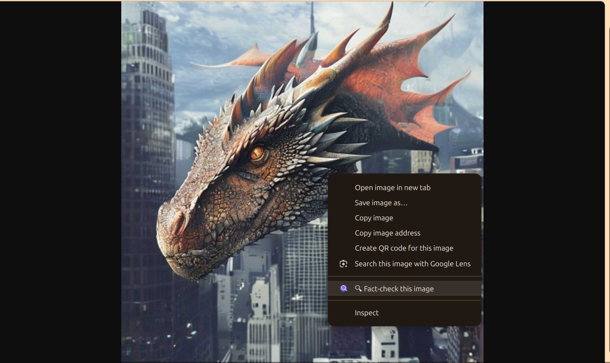
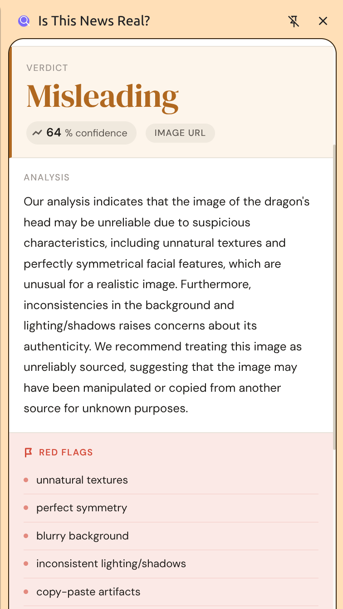
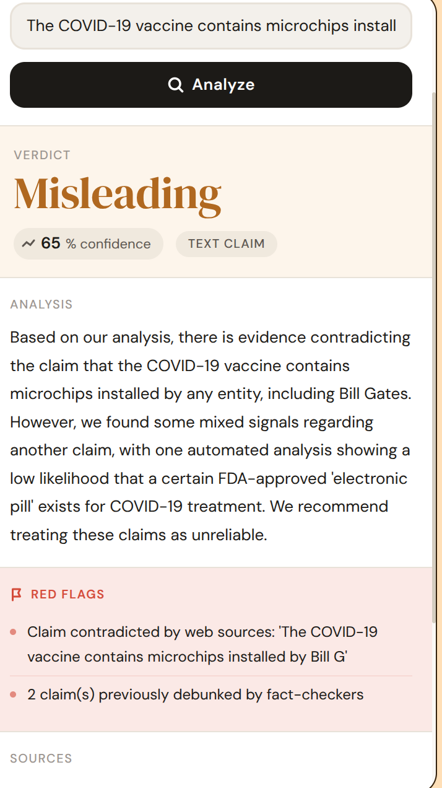
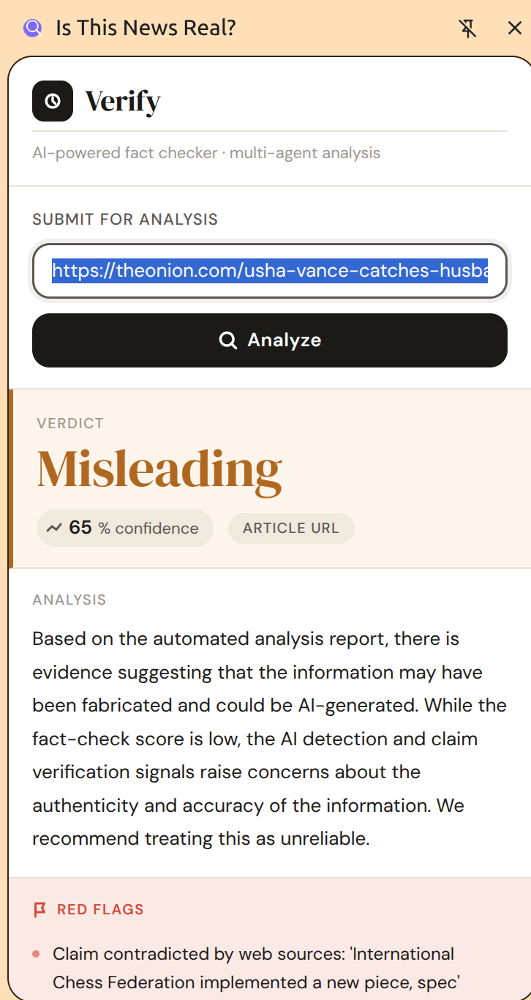

# VERIFY — AI Misinformation Detector

A multi-agent AI pipeline that fact-checks images, articles, and text claims.
Submit anything suspicious — get a verdict in seconds.

Built with LangGraph, Groq, SearXNG, and a Chrome extension frontend.
Fully FOSS. No paywalls. No vendor lock-in.

This program can only be hosted locally right now. Follow the repo to host it on your own server.

---

## What It Does

| Input | What happens |
|-------|-------------|
| Image URL | Forensic analysis (ELA, CNNDetect), visual AI inspection, reverse search |
| Article URL | Scrapes text, extracts claims, verifies each against live web search, checks fact-check databases |
| Text claim | Searches web for contradicting evidence, checks Snopes/Reuters/PolitiFact |

Final output: **REAL / MISLEADING / FAKE / UNCERTAIN** with a confidence score, red flags, and source links.

---

## Architecture

```
Input (image URL / article URL / text claim)
         │
    [Triage Agent]
    Classifies input type, downloads image
         │
    ┌────┴─────────────────────────┐
    │ image path                   │ article / claim path
    ▼                              ▼
[Forensics]                  [Context Scraper]
  • ELA — compression analysis      Trafilatura + Nitter for Twitter
  • CNNDetect — GAN detector (HF)   ▼
  • C2PA — provenance manifest   [Claim Extractor]
    │                              Groq LLaMA — extracts 3 key claims
    ▼                              ▼
[Groq Vision]                 [Claim Verifier]
  LLaMA 4 Scout                  SearXNG x 3 queries per claim
  visual manipulation check       Groq reasons: SUPPORTED/CONTRADICTED
    │                              ▼
[Reverse Search]              [Fact Check]
  SearXNG — finds original        SearXNG → Snopes, Reuters, PolitiFact
  source, builds timeline          ▼
    │                          [AI Text Detection]
    │                              Groq — detects AI-written text
    └──────────────┬───────────────┘
                   ▼
             [Synthesis]
             Weighted scoring + override logic + Groq narrative
                   │
           ┌───────┴────────┐
           │  Final Verdict  │
           └───────┬────────┘
    REAL / MISLEADING / FAKE / UNCERTAIN
    + confidence score (0–100)
    + red flags list
    + source URLs
    + plain-language summary
```

---

## Project Structure

```
Backend/
├── main.py                     ← FastAPI entry point
├── config.py                   ← API keys, model names, weights
├── pipeline.py                 ← LangGraph directed graph
├── requirements.txt
├── .env.example
│
├── agents/
│   ├── state.py                ← Shared TypedDict state
│   ├── triage.py               ← Input classification + image download + OCR
│   ├── forensics.py            ← ELA + CNNDetect + C2PA
│   ├── vision.py               ← Groq LLaMA 4 Scout visual analysis
│   ├── reverse_search.py       ← SearXNG reverse search + timeline
│   ├── context.py              ← Trafilatura scraper + claim extractor
│   ├── claim_verifier.py       ← Web search claim verification
│   ├── fact_check.py           ← Fact-check database search
│   ├── ai_text.py              ← AI text detection via Groq
│   └── synthesis.py            ← Weighted verdict + LLM summary
│
├── api/
│   └── routes.py               ← REST endpoints + SSE + SQLite storage
│
extension/
  ├── manifest.json           ← Chrome Manifest V3
  ├── background.js           ← Service worker + context menus
  ├── sidepanel.html          ← Extension UI
  ├── sidepanel.js            ← Polling + verdict display
  └── generate_icons.py       ← Run once to create icons
```

---

## Quick Start

### 1. Clone and install

```bash
git clone <your-repo>
cd verify
pip install -r requirements.txt
```

### 2. Configure environment

```bash
cp .env.example .env
```

Open `.env` and fill in your keys:

```
GROQ_API_KEY=gsk_your_key_here
HF_TOKEN=hf_your_token_here
SEARXNG_BASE_URL=http://localhost:8080
```

### 3. Start SearXNG

```bash
# First time only
docker run -d --name searxng -p 8080:8080 searxng/searxng

# Enable JSON format
docker cp searxng:/etc/searxng/settings.yml ./settings.yml
echo -e "\nsearch:\n  formats:\n    - html\n    - json" >> settings.yml
docker cp ./settings.yml searxng:/etc/searxng/settings.yml
docker restart searxng

# Every subsequent session
docker start searxng
```

### 4. Run the server

```bash
python main.py
# API live at http://localhost:8000
# Interactive docs at http://localhost:8000/docs
```

---

## API Reference

### Submit for analysis
```bash
POST /api/v1/analyze
Content-Type: application/json

{"input": "https://example.com/image.jpg"}
```
Returns immediately with a `job_id`.

### Poll for result
```bash
GET /api/v1/results/{job_id}
```

### Stream live updates (SSE)
```javascript
const source = new EventSource('http://localhost:8000/api/v1/stream/{job_id}');
source.onmessage = (e) => console.log(JSON.parse(e.data));
```

### Debug — full agent output
```bash
POST /api/v1/debug
{"input": "your input here"}
```
Returns raw state from every agent — useful for diagnosing low scores.

### Browse verdict archive
```bash
GET /api/v1/archive?page=1&per_page=20
```

---

## Verdict Scale

| Verdict | Confidence | Meaning |
|---------|-----------|---------|
| REAL | 0 – 19% | No significant red flags found |
| UNCERTAIN | 20 – 44% | Mixed signals, insufficient evidence |
| MISLEADING | 45 – 69% | Claims contradict available evidence |
| FAKE | 70 – 100% | Strong evidence of falsehood or manipulation |

---

## Scoring System

Each agent produces a **score** (0–1, how fake/manipulated) and a **confidence** (0–1, how sure the agent is). The synthesis agent computes:

```
composite = Σ(score × weight × confidence) / Σ(weight × confidence)
```

Agents that fail or are skipped contribute zero — the pipeline never crashes from a single agent failure.

**Override logic:** If claim verification or fact-check strongly flags fake (score ≥ 0.65), the composite is forced up regardless of other agents. Human-written fake news gets caught even if image forensics returns clean.

**Weights:**

| Agent | Weight |
|-------|--------|
| Claim Verification | 0.25 |
| Fact Check | 0.25 |
| Visual Analysis | 0.20 |
| ELA Forensics | 0.08 |
| CNNDetect | 0.08 |
| AI Text Detection | 0.05 |
| Reverse Search | 0.05 |
| C2PA | 0.04 |

---

## Chrome Extension

### Setup
```bash
cd extension
pip install Pillow
python generate_icons.py
```

1. Open `chrome://extensions`
2. Enable **Developer mode**
3. Click **Load unpacked** → select the `extension/` folder

### Usage
- **Right-click any image** → Fact-check this image
- **Select text → right-click** → Fact-check selected text
- **Right-click page** → Fact-check this page
- **Click toolbar icon** → Manual input panel opens

---

## Environment Variables

| Variable | Required | Where to get it |
|----------|----------|----------------|
| `GROQ_API_KEY` | Yes | console.groq.com — free |
| `HF_TOKEN` | Recommended | huggingface.co/settings/tokens — free read token |
| `GOOGLE_FACT_CHECK_API_KEY` | Optional | console.developers.google.com — free 10k/day |
| `SEARXNG_BASE_URL` | Yes | Self-hosted, see setup above |

---

## Session Startup Checklist

Every time you start working run these three commands:

```bash
docker start searxng
conda activate your_env
python main.py
```

---

## Testing

**Test an AI-generated image:**
```json
{"input": "https://image.pollinations.ai/prompt/hyperrealistic+dragon+in+new+york.jpg"}
```


**Test a known fake claim:**
```json
{"input": "The COVID-19 vaccine contains microchips installed by Bill Gates"}
```

**Test a real article:**
```json
{"input": "https://theonion.com/usha-vance-catches-husband-measuring-her-skull-again/"}
```

---

## Known Limitations

- **Twitter/X URLs** are blocked by their scraper detection.
- **Paywalled articles** only return the first paragraph — claim extraction will work on whatever text is available.
- **CNNDetect** was trained on GAN images and is less accurate on modern diffusion models (Midjourney, DALL-E). Groq Vision compensates for this.
- **AI text detection** has a known false-positive rate on non-native English writing and highly technical content. It is weighted low (0.05) for this reason.
- **SearXNG** must be running for claim verification and reverse search to work. The pipeline degrades gracefully without it but accuracy drops significantly.

---

## License

All models and libraries used are Apache 2.0, MIT, or BSD licensed.

| Component | License |
|-----------|---------|
| FastAPI | MIT |
| LangGraph | MIT |
| Groq Python SDK | Apache 2.0 |
| Trafilatura | Apache 2.0 |
| Pillow | HPND (open) |
| SearXNG | AGPL-3.0 |
| CNNDetect weights | Research use |
| LLaMA 4 Scout | Meta Community License |